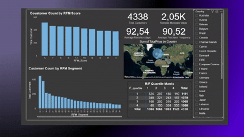

##  Customer Segmentation Pipeline with RFM, K-Means & BI Dashboards

Project demonstrates a full analytics pipeline for eCommerce customer segmentation using RFM analysis and K-Means clustering, followed by interactive Power BI dashboards.

 Project Overview
--------------------
The goal is to analyze customer behavior and identify meaningful segments to support business decisions. The process includes:

- Cleaning and transforming raw transactional data
- Building RFM metrics (Recency, Frequency, Monetary)
- Performing customer segmentation via clustering (K-Means)
- Visualizing insights through interactive dashboards

End-to-End Data Pipeline
----------------------------
This project represents a complete beginner-friendly data pipeline:

1. Data Ingestion → from raw Excel file (`OnlineRetail.xlsx`)
2. Data Cleaning → handled with Python (nulls, outliers, types)
3. Feature Engineering → RFM metrics computed per CustomerID
4. Machine Learning → KMeans clustering to segment customers
5. Storage → SQLite used to store cleaned datasets
6. Visualization → Power BI (and optionally Tableau) used for reporting

Tech Stack
--------------
• Python: pandas, numpy, scikit-learn, matplotlib
• Power BI
• Tableau 
• SQLite

 Dashboards
--------------
### Power BI Dashboard  

RFM & Segmentation Overview:
• KPIs: Total Revenue, Customers, Orders
• RFM Heatmap
• RFM Segment Distribution
• Country Map
• Top Customers
Customer Behavior:
• Customer distribution by country
• Invoice time of day analysis
• Hourly heatmap / customer activity
• Customer type breakdown
Segment Deep Dive:
• Segment vs Country matrix
• Radar chart: avg. RFM metrics per segment
• Line & stacked chart: Active customer behavior across segments

### Tableau Dashboard  

• Segment Distribution: Interactive bar chart of customer count by RFM segment or score.
• RFM Heatmap: Grid showing customer density by Recency and Frequency quartiles.
• Country Map: Bubble map of total revenue by country.
• RFM Segment Chart: Highlights customer distribution across RFM segments.
• ML Target by Country: Shows predicted target rates by country.
• Customer Flow: Sankey-style chart of segment transitions by ML target prediction.

 What I Learned
------------------
• Cleaning and transforming real-world transactional data
• Designing customer value metrics
• Using machine learning in business context
• Building visual dashboards for decision-making
• Structuring end-to-end data projects
• Business Intelligence 
